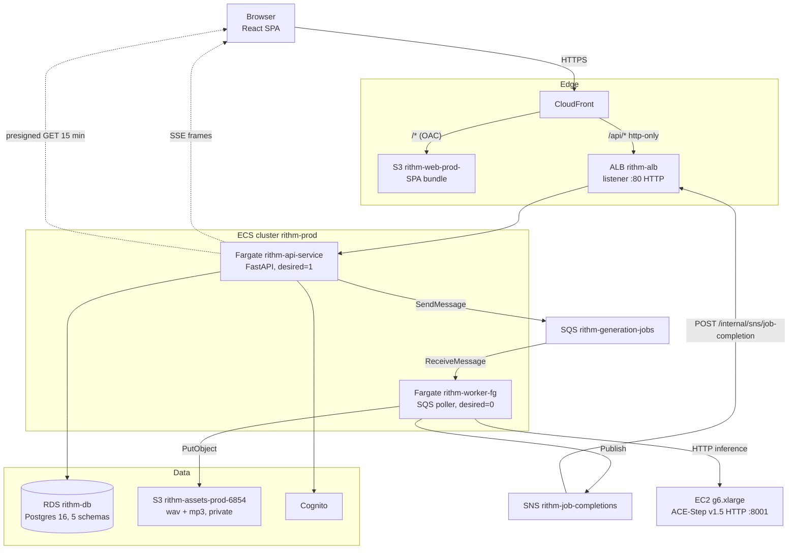
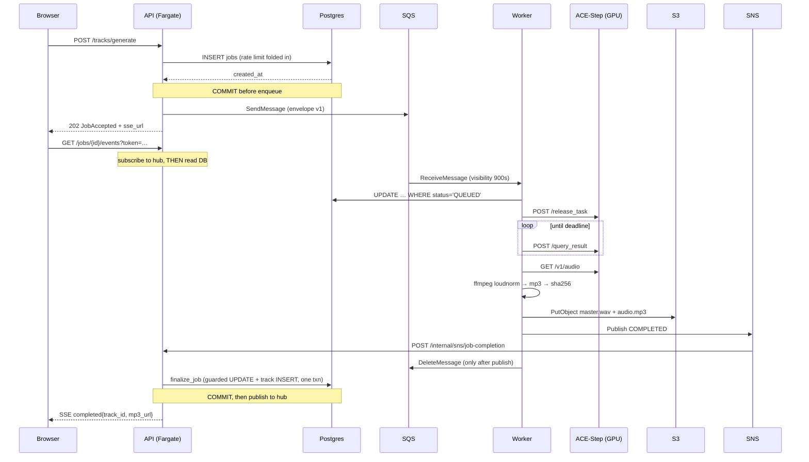

# RITHM Phase 1 — Architecture

**As of 2026-08-15.** AWS account `<ACCOUNT_ID>`, region `us-east-1` (single region, no failover).
Repo `3rdwheeltech-ai/rithm-phase1`, branch `main`.

> **There is no infrastructure-as-code.** No Terraform, CDK, CloudFormation, or SAM exists
> anywhere in the repo. Every AWS resource was created by hand via the console or CLI. The
> JSON under `ops/task-definitions/` is explicitly labelled bootstrap documentation, not the
> deploy source — the deploy workflows describe-and-patch the *live* task definitions instead.
> This document plus `ops/` is therefore the closest thing to a system of record, and it will
> drift. Verify against the account before trusting any identifier here.

> **Identifiers are redacted.** This repo is public, so account-scoped values — the account
> ID, VPC and subnet IDs, instance IDs, the CloudFront distribution, the Cognito pool, the ALB
> and RDS endpoints — appear as `<PLACEHOLDER>`. Resolve them against the live account (or
> `.env.arn`, which is gitignored for the same reason). Nothing here is a credential.

---

## 1. Scope

RITHM is an AI music generation product. A signed-in user describes a track, the system
generates audio on a GPU, and the finished track streams back to the browser in near real time.

This document covers what is deployed and how a request flows through it end to end. It does
not cover product roadmap, model quality, or the ACE-Step model internals. Where the repo
disagrees with the live account, the live account wins and the discrepancy is recorded in
[§14 Known gaps](#14-known-gaps-and-deliberate-trade-offs).

---

## 2. System overview

Three deployable units — a React SPA, a FastAPI monolith, and a Python worker — plus one
self-hosted GPU inference server. The API and the worker never talk to each other directly;
they communicate through SQS in one direction and SNS in the other.



The dotted lines are the return path: the API pushes a Server-Sent Events frame to the waiting
browser, carrying a freshly presigned S3 URL the `<audio>` element plays directly.

---

## 3. Deployed AWS topology

### Edge and delivery

| Resource | Identifier | Notes |
|---|---|---|
| CloudFront | `<CLOUDFRONT_DISTRIBUTION_ID>` → `<CLOUDFRONT_DOMAIN>` | The product URL. No alias, no custom certificate. `DefaultRootObject=index.html` |
| Default behavior | → S3 origin `rithm-web-origin` | Origin Access Control `<ORIGIN_ACCESS_CONTROL_ID>`; GET/HEAD only; `redirect-to-https` |
| `/api/*` behavior | → ALB origin `rithm-alb-origin` | All methods; **origin protocol policy `http-only`** |
| ALB | `rithm-alb` (`<ALB_DNS>`) | Internet-facing, `<VPC_ID>`, subnets `<SUBNET_B>` / `<SUBNET_A>` |
| Listener | **:80 HTTP only** — one default forward rule | No :443 listener exists |
| Target group | `rithm-api-tg`, :8080, target-type `ip`, health check `/health` | |
| SPA bucket | `rithm-web-prod-<ACCOUNT_ID>` | Hashed Vite assets + `index.html`. All public access blocked; reachable only via OAC |

Because CloudFront serves the SPA at `/` and proxies `/api/*` to the same origin, **production
is same-origin and uses no CORS at all**. `CORS_ALLOWED_ORIGINS` is deliberately unset on the
API task; it exists for local development only.

### Compute

| Resource | Identifier | State |
|---|---|---|
| ECS cluster | `rithm-prod` | Container Insights on |
| API service | `rithm-api-service-pqqbkv2h` | Fargate, taskdef `rithm-api:11`, 512 CPU / 1024 MB, **desired 1 / running 1**, `assignPublicIp=ENABLED`, SG `<SECURITY_GROUP_ID>` |
| Worker (Fargate) | `rithm-worker-fg` | taskdef `rithm-worker:4`, **desired 0** |
| Worker (EC2) | `rithm-worker-service` | Capacity provider `rithm-gpu-cp` → ASG `rithm-gpu-asg` (min 0 / max 1 / desired 0), taskdef `rithm-worker:2`, **desired 0** |
| Task families | `rithm-api`, `rithm-api-migrations`, `rithm-worker`, `rithm-worker-stub` | |
| GPU host | `<GPU_INSTANCE_ID>` — g6.xlarge (L4), private IP `<GPU_PRIVATE_IP>`, tag `rithm-worker-poc` | **stopped** |
| Orphan GPU | `<ORPHAN_GPU_INSTANCE_ID>` — g6.2xlarge, tag `rithm-music-worker` | **stopped** |
| ECR | `rithm/api`, `rithm/worker` | Tagged by commit SHA and `latest` |

Note the service name is `rithm-api-service-pqqbkv2h`, not `rithm-api` — the task family and
the service name differ, which matters for every `aws ecs update-service` invocation.

**The GPU boxes live in the default VPC `172.31.0.0/16` while ECS runs in
`<VPC_ID>` (`10.0.0.0/16`).** `ACESTEP_API_BASE=http://<GPU_PRIVATE_IP>:8001` on the
worker task definition therefore points across a VPC boundary. This is a live constraint on
where the worker can actually run.

The API service has `assignPublicIp=ENABLED` because **no NAT gateway exists** in the account.
Every Fargate task needs a public IP to reach ECR, Secrets Manager, SQS, and SNS.

### Data and messaging

| Resource | Identifier | Configuration |
|---|---|---|
| RDS | `<RDS_ENDPOINT>` | Postgres 16.14, `db.t4g.micro`, 20 GB, **single-AZ**, encrypted, 7-day backups, **`PubliclyAccessible: true`** |
| RDS (dev) | `<RDS_DEV_ENDPOINT>` | Same class, `us-east-1b` |
| Jobs queue | `rithm-generation-jobs` | Visibility **400 s**, retention 4 days, redrive → DLQ after **3** receives |
| Jobs DLQ | `rithm-generation-jobs-dlq` | Retention 14 days |
| Completions DLQ | `rithm-sns-completions-dlq` | Retention 14 days |
| Completions topic | `arn:aws:sns:us-east-1:<ACCOUNT_ID>:rithm-job-completions` | One **HTTP** subscription → `http://<ALB_DNS>/internal/sns/job-completion` |
| Alarm topic | `arn:aws:sns:us-east-1:<ACCOUNT_ID>:rithm-alarms` | |
| Assets bucket | `rithm-assets-prod-6854` | Versioned, AES256, all public access blocked |
| Cognito | Pool `<COGNITO_USER_POOL_ID>`, client `2i1f1m58fdois3iatj79rbuehm` | ~18 users |
| Secrets | `rithm/rds/admin`, `rithm/rds/modules`, `rithm/app/secrets` | Injected as env vars by ECS |

The queue's own `VisibilityTimeout` is 400 s, but the worker overrides it **at receive time** to
`SQS_VISIBILITY_TIMEOUT_SECONDS` (900 s on the GPU task definition) — see
`worker/worker/messaging.py:receive_one`. The queue attribute only governs consumers that do
not set it explicitly.

---

## 4. Components

### 4.1 `web/` — React SPA

React 18.3 + TypeScript 5.5 (strict) + Vite 5.3, `react-router-dom` 6 with `BrowserRouter` and
no basename. Tailwind 3.4 carries a design system named "Control Room"
(`web/tailwind.config.ts`), dark-only.

State is split deliberately and the split is documented in `web/README.md`: **TanStack Query v5
owns all server state**, **Zustand owns client-only state** (auth, player, create-form UI).

| Route | Component | Purpose |
|---|---|---|
| `/login`, `/signup` | `pages/Login.tsx`, `pages/Signup.tsx` | Guest-only. Signup posts `consent_version = "tos-2026-05"`, which must match `api/app/config.py` |
| `/` | `pages/Home.tsx` | Quick-generate + recent creations |
| `/create` | `pages/Create.tsx` → `components/create/CreateForm.tsx` | The full generation surface |
| `/library` | `pages/Library.tsx` | Infinite list, optimistic delete |
| `/track/:id` | `pages/TrackDetail.tsx` | Detail, prompt lineage, variation, refine, download |
| `/discover`, `/tools` | lazy-loaded | Roadmap surfaces; every control opens a "coming soon" dialog |

The API base is `"/api/v1"` — **relative, always** (`web/src/lib/api.ts`). No origin is ever
baked into the bundle. Vite's dev proxy mirrors the CloudFront shape so the same relative path
works in both environments.

`components/Player.tsx` holds the app's **only** `<audio>` element. Authenticated routes share
one `Layout` via `<Outlet/>` specifically so navigation never remounts it mid-track.

### 4.2 `api/` — FastAPI modular monolith

Python 3.12, `uv`, FastAPI + Pydantic v2 + SQLAlchemy 2.0 async. Composition root is
`create_app()` in `api/app/main.py`.

The architecture is **bounded contexts, not n-tier**. Five modules under `api/app/modules/`:
`identity`, `catalog`, `generation` (all live) plus `conversation` and `personalization`
(migrated schemas, empty code — cut for launch). Each module is `api.py` (router) →
`service.py` (module singleton) → raw SQL.

**There is no ORM and no declarative `Base`.** `models.py` in each module holds frozen
`@dataclass` row projections (`JobRow.from_row`, `TrackRow.from_row`) and column-list constants;
all persistence is `sqlalchemy.text()` against schema-qualified names.

Module isolation is machine-enforced. `pyproject.toml` declares an import-linter
**independence** contract over all five modules — no module may import another. A module may
depend only on `app.shared` and `app.config`. CI runs `lint-imports`.

The one place two modules must meet is track creation: the generation module needs to write a
`catalog.tracks` row inside its own transaction. That seam is crossed with Protocols, not
imports — `TrackWriter` and `TrackReader` in `api/app/modules/generation/interfaces.py`, with
`catalog_service` injected into `generation_service` at `api/app/main.py:125`. Structural
typing keeps the modules decoupled; pyright verifies conformance at the injection site.

**Route inventory** (all under `/api/v1` unless noted):

| Method | Path | Auth | Handler |
|---|---|---|---|
| GET | `/health` | none | Liveness, zero I/O — an RDS blip must not cycle ECS tasks |
| GET | `/health/deep` | none | `SELECT 1` per module; 503 on any failure. Deliberately **not** wired to any health check |
| POST | `/auth/signup` | none | Validates consent version, Cognito SignUp, inserts `identity.users` |
| POST | `/auth/login` | none | Cognito `USER_PASSWORD_AUTH` |
| POST | `/auth/refresh` | refresh token in body | Resolves `cognito_sub` by email, then `REFRESH_TOKEN_AUTH` |
| GET | `/me` | bearer | Email + `is_admin` |
| POST | `/tracks/generate` | bearer | 202 `JobAccepted` |
| POST | `/tracks/{id}/variation` | bearer | Parent params, new seed distinct from parent |
| POST | `/tracks/{id}/refine` | bearer | `refinement_mode=audio_reference` → 400 |
| GET | `/jobs/{id}` | bearer | Polling fallback; presigns mp3 when complete |
| GET | `/jobs/{id}/events` | **SSE token in query string** | `text/event-stream` |
| GET | `/tracks` | bearer | Keyset pagination; `X-Total-Count`, `X-Next-Cursor`, RFC 8288 `Link` |
| GET | `/tracks/{id}`, `/tracks/{id}/prompts` | bearer | Detail + presigned wav/mp3 + lineage |
| DELETE | `/tracks/{id}` | bearer | Soft delete; 204 first time, 404 on replay |
| POST | `/internal/sns/job-completion` | **SNS signature** | Root-mounted — the subscription URL hardcodes the path |
| POST | `/internal/dev/enqueue-test-job` | **none, dev-only mount** | Must never be mounted in production |

**Ownership misses return 404, never 403** — a 403 confirms the resource exists. This is
enforced in every catalog `WHERE` clause and in `_parent_or_404` / `load_job_status`.

### 4.3 `worker/` — SQS poller

Python 3.11, synchronous, no HTTP surface. Entry point `worker/worker/main.py:main`, run as
`python -m worker.main`. The loop is: 20-second long poll → `process_job(...)` → repeat.

**The image contains no torch and no CUDA.** ACE-Step runs as a separate HTTP server, so the
worker is a thin orchestrator: 914 MB on disk, down from 22.7 GB when the model was in-process.
`worker/Dockerfile` has three stages where `production` is literally `FROM stub` — the images
are byte-identical and only `RITHM_STUB_INFERENCE` distinguishes behaviour.

Three shutdown paths converge on one `threading.Event`:

1. **SIGTERM/SIGINT** (ECS deploy or scale-in) — finish the current job, exit 0.
2. **Idle exit** — `WORKER_IDLE_EXIT_SECONDS` of empty polls, so an ASG can scale the GPU host
   to zero. `0` disables it (what the Fargate services run).
3. **Spot interruption watcher** — a daemon thread polling IMDSv2, harmless on Fargate.

Module layering is enforced by an import-linter **layers** contract:

```
worker.main
worker.processor
worker.inference | worker.storage | worker.messaging | worker.db | worker.audio
worker.aws
worker.config | worker.logging_setup
```

This is load-bearing, not cosmetic: it is *why* `InferenceError` cannot subclass
`RetryableError` (which lives a layer above in `processor.py`), which in turn is why
`inference.py` handles its own retries.

---

## 5. Data architecture

One RDS instance, one database, **five Postgres schemas with five least-privilege LOGIN roles**.
The API opens **five separate engines**, one per bounded context, each with its own DSN and its
own role (`api/app/shared/db.py`). Module isolation is enforced at the database level, not just
in Python: each role has `USAGE` on its own schema only.

Migrations follow the same split — five independent Alembic version trees under
`api/migrations/{module}/`, each with its own `alembic.ini` and `version_table_schema`.
`target_metadata = None` in every `env.py`: autogenerate is deliberately off because there is
no ORM metadata to diff against.

| Schema.table | Key columns | Notes |
|---|---|---|
| `identity.users` | `id`, `cognito_sub` UNIQUE, `email` UNIQUE, `is_admin`, `consent_version` | Root identity |
| `generation.jobs` | `id`, `user_id`, `kind`, `status`, `request_payload` JSONB, `worker_id`, `attempt`, `s3_wav_key`, `s3_mp3_key`, `waveform_hash`, `error` | `status ∈ {QUEUED, RUNNING, COMPLETED, FAILED, DEAD_LETTERED}`. Partial index on active statuses; `(user_id, created_at DESC)` for the rate window |
| `catalog.tracks` | `id`, `user_id`, `source_job_id`, denormalized `genre/mood/bpm/vocal/length_seconds`, `prompt`, `lyrics`, `params` JSONB, S3 keys, `deleted_at` | **`tracks_source_job_uidx` UNIQUE(source_job_id)** is the idempotency backstop |
| `catalog.prompt_history` | `id`, `track_id` FK CASCADE, `prompt`, `delta_command`, `kind` | Lineage for variation/refine |
| `catalog.feedback` | `track_id`, `user_id`, `rating` ∈ {-1,1}, UNIQUE(track_id,user_id) | No API surface yet |
| `conversation.sessions` / `.messages` | session state machine, `tool_calls` JSONB | Schema only; no code |
| `personalization.activity_events` | `user_id`, `event_type`, `metadata` JSONB | Schema only; no code |

All primary keys are **uuid7** minted in Python (`uuid-utils`) — time-ordered, so they index well
and sort chronologically without a separate column.

**Cross-schema foreign keys are logical, not enforced.** A real FK from `catalog.tracks` to
`identity.users` would require cross-schema privileges that would defeat the isolation.

### The grant that shapes the code

`api/migrations/catalog/versions/0002_catalog_generation_grants.py` grants the
`rithm_generation` role: `USAGE` on schema `catalog`, `INSERT` on `catalog.tracks` and
`catalog.prompt_history`, and **column-scoped `SELECT (id, source_job_id)` only**.

That narrowness has two direct consequences in the code:

1. `TrackReader` must exist — reading a parent track for a variation cannot run on the
   generation connection, so it is delegated back to `catalog_service` on catalog's own
   connection.
2. `load_job_status`'s LEFT JOIN may not project one extra column beyond those two, or it fails
   at runtime with a permission error. `api/tests/test_job_status_route.py` pins this.

Migrations run as the **admin** role, not the module roles — the module roles hold DML only and
cannot `CREATE`. The order matters: `identity` migrates first because it owns the shared
`public.touch_updated_at()` trigger function
(`ops/scripts/run-migrations.sh`).

---

## 6. Generation lifecycle, end to end

The path from "user clicks generate" to "audio plays" is a four-hop loop crossing two async
boundaries. This section names the real functions so every step is checkable.



### 6.1 Submit

`POST /api/v1/tracks/generate` → `generate_track` → `_submit` (`api/app/modules/generation/api.py:102`):

1. **Runtime length guard** on top of the schema's static `le=180`.
2. `generation_service.submit(...)` → `_insert_job`, which is a **single statement**:
   `INSERT INTO generation.jobs … SELECT … WHERE (SELECT count(*) … 24h window …) < :limit RETURNING created_at`.
   Folding the rate check into the insert removes the read-then-write window entirely. Zero
   rows returned means rate-limited → 429 with `Retry-After` and `retry_after_seconds` / `used`
   / `limit` in the RFC 7807 body.
   *Residual, documented:* under READ COMMITTED two concurrent requests can both observe the
   same count. The accepted fix is a `pg_advisory_xact_lock`; it is deferred.
   FAILED and DEAD_LETTERED jobs deliberately do not count against the window.
3. **The row commits before the enqueue.** This ordering is chosen, not incidental: a committed
   row with no SQS message is a recoverable stuck job that the sweeper will fail; an SQS message
   with no row is lost work with no record.
4. `send_sqs_message` with envelope schema version 1:
   `{schema_version, job_id, user_id, kind, params, audio_reference_url, parent_track_id, callback_topic_arn, submitted_at}`.
   Note the topic ARN travels **in the envelope** — the worker has no `SNS_COMPLETIONS_TOPIC_ARN`
   of its own. If the send fails, `_fail_job` marks the row FAILED immediately and the route
   returns 503.
5. Route mints an SSE token and returns **202** with `sse_url` embedding it.

Variation and refine differ only in how params are resolved before this point — the parent track
is loaded through `TrackReader`, and by the time `_submit` runs the three kinds are
indistinguishable. **The worker never learns they differed**; `kind` is pure bookkeeping.

### 6.2 Consume

`worker/worker/processor.py:process_job`. The claim is a single atomic statement
(`worker/worker/db.py:claim_job`):

```sql
UPDATE generation.jobs SET status='RUNNING', started_at=now(), worker_id=:w, attempt=attempt+1
WHERE id=:id AND status='QUEUED' RETURNING id
```

It runs in its own committed transaction and the connection is released before inference, so no
DB connection is held across a multi-minute generation (`pool_size=1, max_overflow=1`).

The failure taxonomy is the core of the worker, and the negative cases matter most:

| Branch | Delete message? | Publish to SNS? |
|---|---|---|
| Body is not JSON | yes | no — there is no `job_id` to report |
| `schema_version != 1` | yes | FAILED |
| `claim_job` raises (DB down) | **no** | no → SQS redelivers |
| `claim_job` returns `False` | yes | no — logs `job_already_claimed` |
| `RetryableError` | **no** | no → visibility lapses, SQS redelivers |
| Any other exception | yes | FAILED, error truncated to 500 chars |
| Success | yes, **after** the publish | COMPLETED |

Deleting only after a successful SNS publish means an SNS outage cannot silently swallow a
finished job. Retryable failures deliberately do *not* call `release()` — letting the visibility
window lapse naturally spaces out retries.

### 6.3 Inference

`worker/worker/inference.py` is the only ACE-Step-aware module. ACE-Step v1.5 is reached as an
**HTTP server**, polled, not webhooked:

- `POST /release_task {task_type, caption, lyrics, duration, batch_size, bpm?, dit_model?, seed?}` → `{task_id}`
- `POST /query_result {task_id_list:[id]}` → `status 1` succeeded, `2` failed, anything else still working
- `GET /v1/audio?path=<result file>` → audio bytes

Design details worth knowing:

- **Caption composition** flattens prompt + genre + mood + instruments into one comma-joined
  free-text caption, because ACE-Step has no discrete fields. BPM and vocal are deliberately
  *excluded* — BPM has its own field and vocal is expressed through `lyrics`.
- **The vocal switch is three states in one field**: `"[Instrumental]"` when vocals are off
  (wins unconditionally), the user's verbatim lyrics, or `""` to let the model write them.
- **Only `/release_task` is retried** (`ACESTEP_SUBMIT_ATTEMPTS=3`). Once a `task_id` exists it
  is never re-submitted, so a retry can never cost two GPU runs.
- **The poll deadline scales with duration**: `120s + 1s × length_seconds`. Two components
  because LM planning is roughly flat (6–14 s) while DiT time scales with output length.
- **A failed poll is not a failed job** — it logs and keeps polling to the deadline.
- **Verify, don't trust**: a task reporting success with no output file is refused, and output
  under 1 KB is refused.
- **Boot-time guard**: `load_acestep_model` refuses loudly on an empty `ACESTEP_API_BASE` and
  probes reachability. A transport failure exits non-zero so ECS crash-loops *visibly* rather
  than the service quietly accepting jobs it cannot serve.

### 6.4 Post-process and store

`worker/worker/audio.py` shells out to ffmpeg with fixed argv (no shell), `check=True`,
300-second timeout:

- `loudnorm` — single-pass EBU R128 `I=-14:LRA=11:TP=-1.0`, 44.1 kHz stereo. Two-pass is
  deferred; the signature will not change when it lands.
- `encode_mp3` — libmp3lame 192 kbps.
- `waveform_sha256` — SHA-256 over **decoded s16le PCM**, not the file bytes, so container
  metadata drift does not change the hash. Fits `CHAR(64)`.

S3 keys are a contract (`worker/worker/storage.py`):
`tracks/{user_id}/{job_id}/master.wav` and `tracks/{user_id}/{job_id}/audio.mp3`.
`ContentType` is set explicitly because the API serves these via presigned GET straight into an
`<audio>` element. Temp files are unlinked in a `finally` — best-effort, never fails a job.

### 6.5 Finalize

`api/app/modules/generation/service.py:finalize_job` is where atomicity lives.

1. A **guarded UPDATE**: `… WHERE id=:job_id AND status NOT IN ('COMPLETED','FAILED','DEAD_LETTERED')`.
   Zero rows means duplicate delivery or an unknown id → log and return without writing a track
   or publishing a frame. This is the API-side half of idempotency; the worker's claim is the
   other half.
2. On success, `_write_track` validates the envelope carries wav, mp3, and waveform hash —
   missing any of them raises, so the transaction rolls back, the job stays non-terminal, and
   SNS redelivers.
3. `track_writer.create_track_in_txn` runs **on the caller's generation session**, so the job
   UPDATE, the `catalog.tracks` INSERT, and the `catalog.prompt_history` INSERT commit or roll
   back **together across two schemas owned by different roles**. The catalog insert carries
   `ON CONFLICT (source_job_id) DO NOTHING` and adopts the existing track id on conflict.
4. **The SSE frame is published only after the commit.** Publishing inside the transaction could
   emit a `completed` frame for a track that then rolled back.

The webhook handler wraps `finalize_job` in a bare `except` that still returns **200**. A 5xx on
a valid-but-unactionable message would mean SNS retries → completions DLQ → an alarm about
nothing. Only a signature failure returns 403.

### 6.6 Backstops

`sweep_stuck_jobs` / `run_sweeper` start in the app lifespan (`api/app/main.py:44`). The loop
ticks every 60 s but only works every `SWEEPER_INTERVAL_SECONDS` (300). It fails RUNNING jobs
older than `STUCK_RUNNING_SECONDS` (600, measured from `started_at`) and QUEUED jobs older than
`STUCK_QUEUED_SECONDS` (1800, from `created_at`) with atomic `UPDATE … RETURNING`, publishes
`failed` frames after commit, and swallows every per-tick exception so one bad database moment
cannot kill the event loop.

### 6.7 Three independent idempotency guards

Worth stating together, because no single one is sufficient:

1. **Worker** — `WHERE status='QUEUED'` on the claim. A redelivered message finds the job
   already RUNNING and is dropped without error.
2. **API** — the terminal-status guard in `finalize_job`, backed by
   `UNIQUE(source_job_id)` on `catalog.tracks` as a database-level backstop.
3. **Client** — single-flight token refresh plus replay-exactly-once on 401
   (`web/src/lib/api.ts`), so N concurrent 401s produce one refresh, not N.

---

## 7. Realtime delivery

Progress reaches the browser over Server-Sent Events. Three problems shaped the design.

**EventSource cannot send headers.** So the bearer token is unusable and the API mints a
separate **HMAC SSE token** (`api/app/modules/generation/sse_token.py`):
`base64url(json).hmac_sha256`, verified with `hmac.compare_digest`, TTL 1800 s, embedded in the
`sse_url` the 202 returns. Expiry raises a distinct `SSETokenExpired` so the route can return
`problem_type = https://rithm.dev/errors/sse-token-expired` — the client uses that specific type
to switch to polling instead of treating it as a logout. `api/app/main.py:29` refuses to boot in
production if `SSE_TOKEN_SECRET` is still the repo default.

**EventSource hides the HTTP status of a failed connection.** So on its second consecutive
failure, `web/src/hooks/useJobStream.ts` re-fetches the same URL with `fetch` purely to read the
status and distinguish an expired token from a transient blip.

**A silent stream is indistinguishable from a hung one.** So the server emits a **named**
`keepalive` event every 15 s — not a `:` comment, because EventSource fires no handler for
comments and the client's watchdog could not observe one. The client treats 25 s of silence as
dead and reconnects.

The client state machine keeps `JobPhase` (`idle|queued|running|completed|failed|lost`) strictly
separate from `ConnectionState` (`connecting|open|retrying|polling|closed`) — conflating them
makes a reconnect look like a failed generation. Reconnect backoff is `[1,2,4,8,15]s` with ±20%
jitter; after 6 consecutive failures it falls back to polling `GET /jobs/{id}` every 5 s with a
15-minute ceiling, then declares `lost`.

Server-side, `_event_stream` **subscribes to the hub before reading the database**. The reverse
order loses a completion that lands in the gap — a classic lost wakeup. Current state is then
replayed as a frame; a `queued` frame carries `estimated_start_seconds` so a cold start does not
read as hung. Streams are capped at 900 s. Per-subscriber queues are bounded at 64 and a slow
consumer is dropped rather than blocking the publisher.

### The constraint this creates

**The SSE hub is in-process.** A completion delivered to task A never reaches a stream held by
task B. Therefore the API runs **single-process (no `--workers`, no Gunicorn) at
`desiredCount=1`**. This is an architectural constraint, not a cost decision, and it is the
single biggest blocker to horizontally scaling the API. Redis-backed pub/sub is the explicit
Phase-2 decision. A deploy briefly running two tasks is a known source of stranded streams —
which is what the client's polling fallback exists to cover.

---

## 8. Authentication and identity

Cognito, backend-mediated — there is no hosted UI and no OAuth redirect flow.

- The app client is **confidential** (has a secret), so every Cognito call carries
  `SECRET_HASH = Base64(HMAC-SHA256(secret, username + client_id))`
  (`api/app/modules/identity/service.py:_secret_hash`). The refresh flow must use the `sub`, not
  the email alias.
- Token verification (`api/app/shared/auth.py`): `PyJWKClient` caches JWKS from the pool,
  `jwt.decode` with RS256, audience, issuer, and `require=["exp","iss","sub"]` — then rejects
  anything where `token_use != "id"`. **ID tokens only**, never access tokens.
- **Local user rows are created lazily.** `require_user` maps `cognito_sub` → `identity.users.id`
  and inserts the row with `ON CONFLICT (cognito_sub) DO NOTHING` on first authenticated
  request. That UUID is the identity every other module uses.
- There are no sessions and no cookies. **There are no role or scope checks anywhere** —
  `is_admin` exists on the table and in `MeResponse` but nothing gates on it. Authorization is
  entirely row ownership expressed in SQL.

Token lifetimes on the live pool: ID and access tokens **60 minutes**, refresh token **5 days**.
MFA is **off**; email is the username and is auto-verified; password policy is min 8 with
uppercase and a number.

Client-side (`web/src/store/auth.ts`), the **ID token lives in memory only** — it is the
credential that spends GPU budget, so XSS cannot lift it from storage. Only the refresh token
and the email are persisted to localStorage under `rithm-auth`; the email is persisted because
`POST /auth/refresh` needs it to compute `SECRET_HASH`.

The webhook path has its own auth: `api/app/shared/sns_verify.py` reconstructs the canonical
signing string per message type, fetches and caches the signing certificate, enforces an
`^https://sns\.[a-z0-9\-]+\.amazonaws\.com/` host allowlist (the load-bearing check), and
supports SignatureVersion 1 and 2.

---

## 9. Async and compute characteristics

**Generations serialize.** One ACE-Step server on one GPU processes one task at a time, so ten
concurrent requests queue behind each other. `ops/scripts/load-test.py` documents this
explicitly and asserts on it. Queue depth is the user-visible latency driver, not API capacity.

**There is no per-job SQS heartbeat.** No visibility-extension loop exists. The design
substitutes a large receive-time visibility timeout (900 s) plus the claim guard: if a worker
dies mid-job, the message reappears, the claim finds the row already RUNNING and drops it, and
the sweeper fails the row. Crash semantics are clean in both directions — crash after the claim
commits leaves a RUNNING row for the sweeper; crash before leaves it QUEUED for SQS.

**The worker is consumer-only by IAM contract** (never `SendMessage`), and the API is
**producer-only** (never `ReceiveMessage`). The permission boundary enforces the direction of
the dataflow.

The GPU half runs under systemd on EC2 (`ops/systemd/acestep.service`):
`uv run acestep-api --host 0.0.0.0 --port 8001` as `ec2-user`, `Restart=always`,
`RestartSec=10`, `TimeoutStartSec=600` (model load takes ~2 minutes on an L4). It replaced a
transient `systemd-run` unit that was called out as the single largest availability risk in the
system.

---

## 10. Storage

The assets bucket `rithm-assets-prod-6854` is versioned, AES256-encrypted, and has all four
public-access blocks on. Lifecycle rules:

| Prefix | Rule |
|---|---|
| `uploads/` | Expire after 10 days |
| `tts/` | Expire after 10 days |
| `tracks/` | Non-current versions expire after 30 days |

Delivery is **presigned GET with a 900-second TTL**, signed locally by the API
(`api/app/shared/aws.py:presign_get`) with no network round trip. This is the launch stand-in
for CloudFront signed URLs — `cloudfront_distribution_domain`,
`cloudfront_signing_key_pair_id`, and `cloudfront_signing_key` all exist in `api/app/config.py`
and are **unused**.

The 15-minute TTL propagates into the client: `web/src/lib/queryClient.ts` sets `staleTime` to
5 minutes specifically to keep a 3× margin under it, and `components/Player.tsx` refetches
exactly once on an expired-URL playback error before giving up.

The SPA bucket has a **mandated deploy order**, documented inline in `deploy-web.yml`: hashed
assets sync first with `max-age=31536000,immutable`, then `index.html` with
`no-cache,no-store,must-revalidate`, then a `/*` invalidation. `index.html` is the index of
*which* content hashes exist, so caching it after a `--delete` sync produces a white page of
403s.

---

## 11. CI/CD

Four workflows, all in `.github/workflows/`. Path filtering happens **inside** the workflow with
`dorny/paths-filter`, never as `on.paths` — otherwise branch protection waits forever for a
check that never reports.

**`ci.yml`** — PR to `main` and push to `main`. `permissions: contents: read` only: **CI holds no
AWS credentials at all.**

- `api`: `postgres:16` service, `uv sync --frozen`, `ci-bootstrap-db.sh`, then `ruff check`,
  `ruff format --check`, `lint-imports` (the module independence contract),
  `pyright-ratchet.sh` (fails only if the error count exceeds a checked-in baseline), `pytest`.
  Tests run as `rithm_generation` with a second admin DSN for setup and verification — needing
  two DSNs is itself the evidence the grant is narrow.
- `worker`: same lint/typecheck/test chain, no database.
- `web`: `npm ci → lint --max-warnings 0 → typecheck → test → build`. The build is a gate.

**`deploy-api.yml`** — push to `main` on `api/**`. `id-token: write` for OIDC, no static keys.

1. Assume `AWS_DEPLOY_ROLE_ARN` via OIDC → ECR login.
2. `docker buildx build --platform linux/amd64 --target production`, tagged `:$GITHUB_SHA` and
   `:latest`.
3. **Migration gate**: `aws ecs run-task` on family `rithm-api-migrations`, then
   `ecs wait tasks-stopped` and an explicit non-zero exit check. A failed migration aborts the
   deploy and leaves the *old* image serving.
4. **Register by describe-and-patch**: `describe-task-definition` → `jq` replaces only
   `containerDefinitions[0].image` and strips read-only fields → `register-task-definition`.
   The template is deliberately never rendered, so console-tuned values survive deploys.
5. `update-service` → `ecs wait services-stable`.

**`deploy-worker.yml`** — builds and pushes, then **registers a revision and stops**. There is no
`update-service`, because the worker service sits at desiredCount 0 between jobs and picks up
the new revision on the next scale-up. The deployer role has no permission to update it.

**`deploy-web.yml`** — Node 20 build, OIDC, then the three ordered S3/CloudFront steps from §10.

The deploy role `iam-github-deployer` is tightly scoped: ECR push to the two repos;
`ecs:RunTask` restricted to family `rithm-api-migrations` *with an `ecs:cluster` condition on
`rithm-prod`*; `ecs:UpdateService` scoped to the single API service ARN; `iam:PassRole`
conditioned on `iam:PassedToService=ecs-tasks.amazonaws.com`; S3 write on the web bucket only;
`cloudfront:CreateInvalidation` on distribution `<CLOUDFRONT_DISTRIBUTION_ID>` only. **The trust policy pins
`sub` to `repo:3rdwheeltech-ai/rithm-phase1:ref:refs/heads/main`** — no other branch, tag, or
environment can assume it.

---

## 12. Observability and operations

**Logging** is structlog JSON to stdout, and the API and worker configurations deliberately
mirror each other (`api/app/shared/logging.py`, `worker/worker/logging_setup.py`) so **a single
CloudWatch Logs Insights query on `job_id` follows a job across all four hops**: API submit →
worker claim → worker complete → API finalize.

Both include a `_scrub_sensitive` processor redacting `password`, `id_token`, `refresh_token`,
`api_key`, `authorization`, `access_key`, `secret_key`, `cognito_sub`, `openai_api_key`, and the
worker DSN. Both omit `add_logger_name`, which is incompatible with `PrintLogger`.

**Correlation**: `RequestIdMiddleware` binds `request_id` (from `X-Request-Id` or a fresh uuid4)
into structlog contextvars for the request's lifetime, echoes it on the response, and includes
it in every RFC 7807 error body. The web client surfaces it to the user on 5xx.

**Errors**: `register_error_handlers` registers on *Starlette's* `HTTPException` so router-level
404/405 are caught too, plus `RequestValidationError` → 422 (through `jsonable_encoder`,
otherwise a model-validator `ValueError` turns a 422 into a 500), plus a catch-all → 500 logged
as `unhandled_error`.

**Named log events** are the metric-filter surface (no metric filters are configured yet):
`job_submitted`, `job_finalized`, `enqueue_failed`, `finalize_job_already_terminal`,
`finalize_job_unknown_id`, `track_created`, `sns_signature_invalid`, `sweeper_failed_jobs`,
`job_already_claimed`, `retryable_failure`, `permanent_failure`, `acestep_poll_failed`,
`spot_interruption`, `idle_exit`.

**There is no tracing and no metrics emission.** `aws-embedded-metrics` is a declared dependency
with no importer; no OpenTelemetry or X-Ray instrumentation exists.

**Alarms currently live in the account**, all notifying `rithm-alarms`:

| Alarm | Trigger | Protects against |
|---|---|---|
| `rithm-api-5xx-rate` | ALB target 5xx > 5 per 5 min | Broken deploy, unhandled exceptions |
| `rithm-api-no-healthy-hosts` | Healthy hosts < 1 for 3 min | API down; `TreatMissingData: breaching` |
| `rithm-generation-dlq-depth` | ≥ 1 message | Jobs failing repeatedly |
| `rithm-sns-completions-dlq-depth` | ≥ 1 message | **The worst silent failure**: the track exists in S3 and the user was never told |
| `rithm-jobs-queue-stalled` | Oldest message > 600 s, 2 periods | No worker consuming |

Two additional `TargetTracking-rithm-gpu-asg-*` alarms drive ECS managed scaling for the GPU
capacity provider. `ops/cloudwatch/alarms.json` defines a sixth alarm,
`rithm-acestep-box-unhealthy` (EC2 status check with an `ec2:recover` action), which is **not
currently deployed**.

**Health checks**: `/health` does zero I/O and backs both the ALB target group and the container
`HEALTHCHECK`, so a database blip cannot cycle ECS tasks. `/health/deep` runs `SELECT 1` per
module and returns 503 on any failure — it is explicitly documented as never to be wired to a
health check.

**Operational tooling** in `ops/scripts/`:

| Script | Purpose |
|---|---|
| `put-alarms.sh` | Renders `alarms.json` through a **jq allow-list** (not envsubst) and upserts each alarm by name. Has `--dry-run` |
| `drain-dlq.sh` | Inspect or drain a DLQ. Refuses non-`*-dlq` names, prints by default, deletes only with `--delete`, avoids `PurgeQueue` entirely |
| `set-log-retention.sh` | Sets 30-day retention. Needed because every task definition uses `awslogs-create-group: true`, which creates groups with **no** retention policy |
| `run-migrations.sh` | Alembic `upgrade head` per module in dependency order |
| `load-test.py` | Drives N concurrent generations and asserts terminal states, that the track-count delta equals completions (the double-claim check), distinct track ids, and unchanged DLQ depths |
| `rds-bootstrap.sql` | One-time: extensions, shared trigger, five schemas, five LOGIN roles with DML-only grants |
| `init-localstack.sh` | Creates local buckets, queues (with redrive), and topics |

---

## 13. Security posture

**Good:**

- Five least-privilege database roles with schema-scoped `USAGE`; the cross-schema grant is
  column-scoped down to two columns.
- Migrations run as a separate admin role that the runtime never holds.
- Secrets are injected by ECS from Secrets Manager as env vars; **no secrets client exists in
  application code**. The trailing `::` on every secret ARN is load-bearing — without it ECS
  injects the whole JSON blob instead of one field.
- Both S3 buckets block all public access; the SPA bucket is reachable only through OAC.
- GitHub deploys use OIDC with no static credentials, and the trust policy is pinned to `main`.
- ID token never touches browser storage; structured logs scrub credentials at the processor
  level, not the call site.
- Ownership misses return 404 rather than 403, so the API does not confirm the existence of
  other users' resources.
- The dev-only enqueue endpoint is guarded at *registration* time, not inside the handler, and
  `RITHM_DEV_ENDPOINTS` is deliberately absent from the production task definition.

**Weak — see §14 for the full list:** no HTTPS listener on the ALB, RDS publicly accessible, no
WAF, MFA off, and a plaintext-credential file on the developer's disk.

---

## 14. Known gaps and deliberate trade-offs

### Chosen constraints (understood, documented, accepted for launch)

| Constraint | Reason |
|---|---|
| API pinned to `desiredCount=1`, single process | The SSE hub is in-process. Redis-backed pub/sub is the Phase-2 fix |
| `assignPublicIp=ENABLED` on every task | No NAT gateway exists |
| Presigned S3 GET instead of CloudFront signed URLs | Config exists in `api/app/config.py`, unused |
| `conversation` and `personalization` schemas migrated but code-empty | Cut for launch; migrations landed to avoid a later coordinated deploy |
| Bedrock / OpenAI configured but never called | `compose_refined_prompt` uses string composition as the documented seam an LLM will take over |
| Single-pass `loudnorm` | Two-pass deferred; the function signature will not change |
| No per-job SQS heartbeat | Large visibility timeout + claim guard cover the same failure modes |
| Rate-limit race under READ COMMITTED | Accepted; `pg_advisory_xact_lock` is the identified fix |
| Genre/mood vocabularies duplicated across Python and TypeScript | Each side pinned by its own test rather than sharing a generated artifact |

### Drift and risk (not intended, needs triage)

| Issue | Impact |
|---|---|
| **`rithm-jobs-queue-stalled` is in ALARM with a message stranded, and both worker services are at `desiredCount=0` with both GPU instances stopped** | Nothing can drain the queue. Generation is effectively offline |
| **No HTTPS listener on the ALB**; CloudFront reaches the origin `http-only` and **SNS posts the completion webhook over plain HTTP** | Traffic between CloudFront/SNS and the ALB is unencrypted. Requires a domain + ACM cert to fix |
| **RDS `PubliclyAccessible: true`, single-AZ, `db.t4g.micro`** | Internet-reachable database; no failover; ~110 max connections |
| **No IaC** | Every resource is hand-created; no review, no reproducibility, no drift detection |
| No ECS autoscaling policies on the API | Load response is manual |
| All nine `ops/runbooks/*.md` are 3-line placeholders | `alarms.json` and the launch notes reference `dlq-drain.md` and `worker-stuck.md` as if written |
| Both CloudWatch dashboards (`rithm-ops.json`, `rithm-cost.json`) are empty stubs | |
| `rithm-alarms` may have no confirmed subscriber | Alarms fire into the void |
| **`docs/local-misc/env-snapshot.md` contains live credentials in plaintext** — an AWS access key pair, the Cognito client secret, and all six database passwords | Gitignored and untracked, but unencrypted on disk. Standing rotation risk |
| `taskdef.json` records `ASSETS_BUCKET` as an **ARN** rather than a bare bucket name | boto3 needs `Bucket=<name>`; an ARN yields presigned URLs that do not resolve |
| `.env.arn` names `ECS_WORKER_SERVICE=rithm-worker-stub-service`, which no longer exists | Stale scratch file |
| Stale `rithm-web-prod-6854` bucket; orphan `rithm-music-worker` g6.2xlarge instance | Cost and confusion |
| `README.md` still says CI/deploy workflows are "Day 1 stubs" | Stale; the pipelines are complete |
| GPU hosts are in the **default VPC** while ECS runs in `<VPC_ID>` | Cross-VPC path for `ACESTEP_API_BASE` |
| `ops/runbooks` and `docker-compose.yml` reference `ops/scripts/fake-complete-job.sh` | The script does not exist |
| `web/` has `@playwright/test` and a `test:e2e` script but no `e2e/` directory or config | Deferred past launch |
| ACM cert for `demo.rithmmusic.com` (`…/2eed638c-fbeb-4285-a3ef-88b3e1335af0`) is unvalidated | Blocks the HTTPS and custom-domain fix |

Cost shape at launch, for context: the always-on GPU is roughly 85% of spend (~$588/mo), with
API Fargate ~$18, worker Fargate ~$36, ALB ~$18, and everything else ~$40–60.

---

## 15. Appendix

### A. Environment variables

**API** (`api/app/config.py`; required fields fail the boot if absent):

Required — `DB_IDENTITY_DSN`, `DB_CATALOG_DSN`, `DB_GENERATION_DSN`, `DB_CONVERSATION_DSN`,
`DB_PERSONALIZATION_DSN`, `ASSETS_BUCKET`, `SQS_JOBS_QUEUE_URL`, `SNS_COMPLETIONS_TOPIC_ARN`.

Behavioural — `ENVIRONMENT` (gates `/docs`, `/openapi.json`, and the SSE-secret boot check),
`RATE_LIMIT_PER_24H`, `MAX_LENGTH_SECONDS`, `SSE_TOKEN_TTL_SECONDS`, `SSE_HEARTBEAT_SECONDS`,
`SWEEPER_ENABLED`, `SWEEPER_INTERVAL_SECONDS`, `STUCK_RUNNING_SECONDS`, `STUCK_QUEUED_SECONDS`,
`ESTIMATED_COLD_START_SECONDS`, `CURRENT_CONSENT_VERSION`, `DB_REQUIRE_SSL`,
`CORS_ALLOWED_ORIGINS`, `RITHM_DEV_ENDPOINTS`, `LOG_LEVEL`.

Secrets — `SSE_TOKEN_SECRET`, `COGNITO_APP_CLIENT_SECRET`, `OPENAI_API_KEY` (unused).

> The live task definition sets `RATE_LIMIT_PER_24H=1000000`, effectively disabling the rate
> limit. The template default is 20.

**Worker** (`worker/worker/config.py`, `env_file=None` — container environment only):

`SQS_JOBS_QUEUE_URL`, `ASSETS_BUCKET`, `DB_GENERATION_DSN_SYNC`, `AWS_REGION`,
`SQS_VISIBILITY_TIMEOUT_SECONDS`, `WORKER_IDLE_EXIT_SECONDS`, `MAX_LENGTH_SECONDS`,
`RITHM_STUB_INFERENCE`, `LOG_LEVEL`, and the ACE-Step group: `ACESTEP_API_BASE`,
`ACESTEP_TASK_TYPE`, `ACESTEP_DIT_MODEL`, `ACESTEP_SEND_SEED`, `ACESTEP_HTTP_TIMEOUT_SECONDS`,
`ACESTEP_POLL_INTERVAL_SECONDS`, `ACESTEP_POLL_TIMEOUT_BASE_SECONDS`,
`ACESTEP_POLL_TIMEOUT_PER_LENGTH_SECOND`, `ACESTEP_SUBMIT_ATTEMPTS`.

`SNS_COMPLETIONS_TOPIC_ARN` is deliberately **not** a worker variable — the topic ARN arrives in
each job envelope.

### B. Local development

```bash
cp .env.example .env.local
docker-compose up -d --wait          # Postgres :5433 + LocalStack :4566 + API :8080
curl -s http://localhost:8080/health
cd web && npm install && npm run dev  # http://localhost:5173
```

The worker is intentionally absent from `docker-compose.yml` — it needs a GPU. LocalStack covers
S3, SQS, and SNS only; **Cognito always hits real AWS** because LocalStack's coverage is
incomplete. `docker-compose down -v` resets database state.

### C. Related documents

- `README.md` — repository layout and local quickstart (note: the CI/CD section is stale)
- `ops/runbooks/` — nine runbooks, currently placeholders
- `ops/task-definitions/*.template` — bootstrap documentation with extensive rationale comments;
  `worker.json.template`'s header is the best record of the sidecar-vs-standalone GPU decision
- `docs/others/pushing-db-prod.md` — the RDS bootstrap runbook
- `docs/local-misc/five-day-launch-plan/` — the day-by-day specs and execution summaries this
  system was built against
